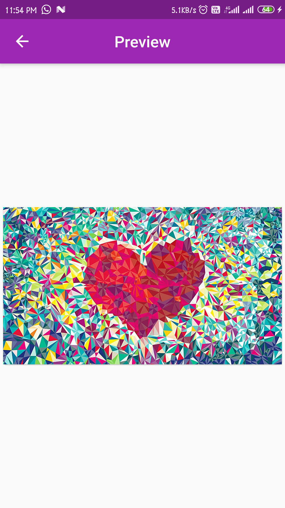
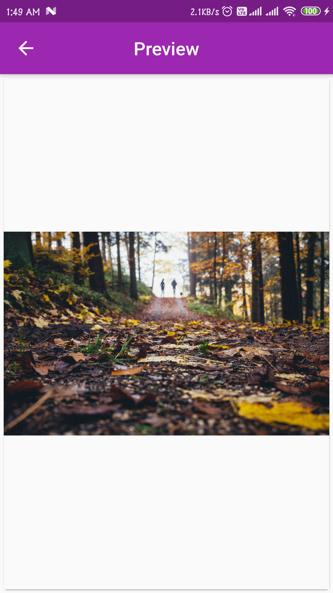

# gallery_app

Simple gallery app for android build Flutter

Just to demonstrate basic function of galley app

#### Features
- [x] Multiple Image
- [x] Duble Tap ZoomIn/ZoomOut
- [x] Pinch ZoomIn/ZoomOut
- [x] Rotation Enable

## Getting Started

This project is a starting point for a Flutter application.

A few resources to get you started if this is your first Flutter project:

### Screenshots
***
              

***

